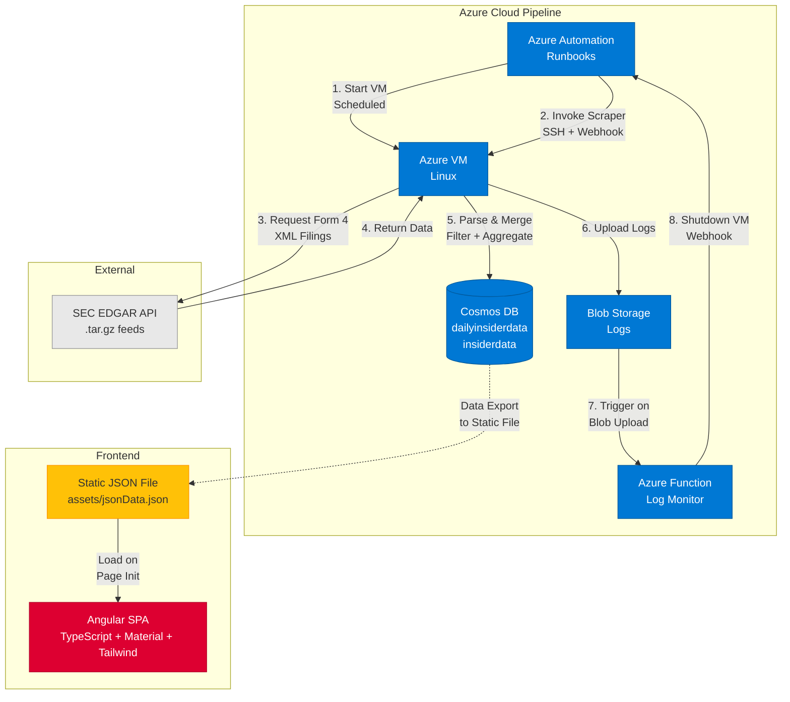

<a href="https://github.com/B-rody/InsiderScraper" target="_blank" class="btn btn--info"><i class="fab fa-github"></i> View on GitHub</a>

## Summary
InsiderScraper is a web application that surfaces recent insider stock purchase filings from the SEC EDGAR database in a clean, filterable interface. Instead of manually navigating through dense SEC filing archives, users get a rolling 30-day view of insider common stock purchases aggregated by company, with real-time filtering by symbol, share count, transaction value, and buyer metrics.

I built it as a hands-on way to learn Angular's single-page application architecture and gain experience orchestrating automated data pipelines in Azure's serverless ecosystem.

## Role & Scope
I designed and implemented the entire system from concept to deployment, including the data scraping pipeline, cloud automation workflow, database schema, and frontend interface. This was a solo project built to explore Angular's component model, Azure's serverless offerings, and real-world ETL challenges like incremental updates and data hygiene.

## System Overview
The system runs as an Angular 12 single-page application (TypeScript, Angular Material, Tailwind CSS) that loads data from a static JSON file, backed by a fully automated Azure cloud pipeline that updates this data daily. The backend orchestrates scheduled scraping, parsing, and database updates without manual intervention.

The automation pipeline consists of four Azure services working in sequence:

- **Azure Automation**: Three runbooks coordinate the workflow — one starts the Linux VM on schedule, another invokes the scraper script via SSH and webhook, and the third stops the VM after processing completes or times out after 3 hours.
- **Azure VM (Linux)**: Hosts the Python scraper that pulls compressed `.tar.gz` feeds from SEC EDGAR, extracts Form 4 XML filings, parses insider purchase transactions (transaction code "P"), filters for direct ownership (ownership nature "D"), and merges new data with existing records in Cosmos DB while pruning entries older than 30 days.
- **Azure Function**: Blob storage trigger that monitors scraper logs. When errors are detected, it invokes the VM shutdown webhook to clean up resources.
- **Cosmos DB**: NoSQL database storing two containers — `dailyinsiderdata` for the latest scrape and `insiderdata` for the rolling 30-day aggregated dataset.

The scraper handles incremental updates intelligently: it merges new transactions by matching company symbols and insider CIKs (unique SEC identifiers), updates aggregate metrics (total shares, total value, buyer count), and deletes stale entries based on transaction date. The Python script includes retry logic with 60-second delays for SEC API failures (up to 4 attempts) and logs every step to blob storage for monitoring.

Here's a high-level view of the architecture and flow

The frontend provides two primary views: a **Symbol Data** view that aggregates all transactions by ticker with expandable trader details, and a **Transaction Data** view showing individual purchase records in a sortable, filterable table. Users can filter by symbol, minimum share count, transaction value, number of buyers, or transaction date, with results updating dynamically via Angular's reactive programming model using RxJS observables. The frontend loads data from a static JSON file bundled with the application.

## Interface Walkthrough

**Symbol filtering and aggregated view:**

<video width="100%" controls style="max-width: 800px; margin: 2rem auto; display: block; border-radius: 8px; box-shadow: 0 4px 12px rgba(0,0,0,0.15);">
  <source src="https://user-images.githubusercontent.com/44855384/190001886-a54d932c-bde8-4f17-9f7f-c7c5817a6084.mp4" type="video/mp4">
  Your browser does not support the video tag.
</video>

Filtering by ticker symbol and expanding to view individual insider details

**Drilling into aggregated symbol data:**

<video width="100%" controls style="max-width: 800px; margin: 2rem auto; display: block; border-radius: 8px; box-shadow: 0 4px 12px rgba(0,0,0,0.15);">
  <source src="https://user-images.githubusercontent.com/44855384/190002079-d279493a-58ea-40f1-bad4-ed7937174b8f.mp4" type="video/mp4">
  Your browser does not support the video tag.
</video>

Exploring transaction details within a single symbol

**Transaction-level filtering and sorting:**

The navigation header provides access to the raw Transaction Data view, where users can filter and sort individual purchase records by symbol, share count, transaction value, or date.

<video width="100%" controls style="max-width: 800px; margin: 2rem auto; display: block; border-radius: 8px; box-shadow: 0 4px 12px rgba(0,0,0,0.15);">
  <source src="https://user-images.githubusercontent.com/44855384/190002716-30d4031f-bf0f-4d25-939b-2608907933fb.mp4" type="video/mp4">
  Your browser does not support the video tag.
</video>

Filtering and sorting raw transaction records

## Key Challenges
- **XML parsing consistency:** SEC Form 4 filings have inconsistent structures — some lack price data, others use indirect ownership flags. I added defensive parsing with null checks and explicit filtering for transaction code "P" (purchase) and ownership nature "D" (direct) to ensure only relevant data made it through.
- **Incremental data merging:** Daily scrapes needed to merge with existing data without duplicating entries or losing historical context. I implemented a merge strategy that matches by symbol and insider CIK, updates aggregate metrics, and prunes entries older than 30 days, ensuring the database stays current without manual intervention.
- **Error recovery and monitoring:** API failures, malformed XML, or database connection issues could silently break the pipeline. I added structured logging to blob storage, retry logic with 60-second delays for SEC requests (up to 4 attempts), and an Azure Function that scans logs for error patterns and triggers VM shutdown via webhook when processing completes or errors are detected.
- **Scheduled orchestration:** Coordinating VM startup, script execution, and shutdown without leaving resources running required webhook-based communication between runbooks and a fallback scheduled shutdown 3 hours after VM start to handle webhook failures.

## Outcomes
The final system runs fully automated daily scrapes at scheduled intervals, processing hundreds of SEC filings and updating Cosmos DB without manual intervention.

Users can explore 30 days of insider purchase activity in seconds, filtering down from thousands of transactions to targeted subsets (e.g., "show me symbols with 5+ buyers purchasing $1M+ in shares"). The filtering and sorting UI responds instantly since all data is client-side, loaded from a static JSON file on page load.

Building InsiderScraper taught me a lot about Azure's serverless ecosystem (Functions, Automation, Cosmos DB), Python-based ETL pipelines with incremental updates, Angular's component architecture and reactive data patterns, XML parsing and data hygiene challenges in real-world datasets, and cloud orchestration patterns for scheduled, event-driven workflows.

## What This Project Highlights
- Automated cloud pipeline design (Azure Automation, Functions, VM orchestration)
- Python ETL scripting (SEC EDGAR API, XML parsing, incremental merging)
- Azure Cosmos DB data modeling (NoSQL schema, partition keys, upsert patterns)
- Angular single-page application (TypeScript, RxJS, reactive data binding)
- Angular Material + Tailwind CSS (responsive filtering UI, sortable tables)
- Error monitoring and alerting (blob triggers, SMS notifications, structured logging)
- Real-world data challenges (inconsistent XML, date-based pruning, deduplication)
