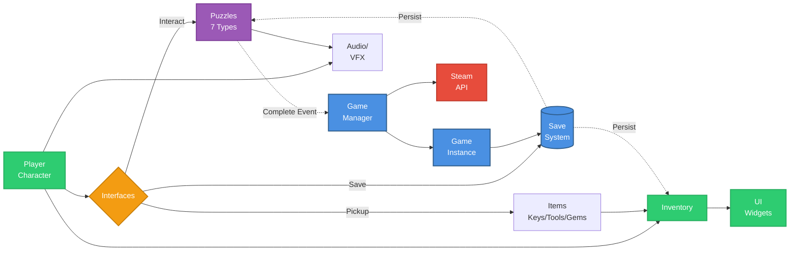

## Summary

This project is a first-person environmental puzzle game built in Unreal Engine 5.3 that challenges players to
explore an interconnected multi-room environment. Players solve various puzzles to
progress through the space, collecting key items and uncovering environmental narrative elements through
interactive documents and objects.

I built it as a hands-on way to learn Unreal Engine's blueprint visual scripting system, explore environmental
puzzle design, and implement persistent save systems for game states.

## Role & Scope

I led the entire design and implementation, from initial concept to Steam integration.
Throughout development, I integrated marketplace asset packs to accelerate content creation while focusing on
building robust gameplay systems, puzzle mechanics, and save persistence. Every blueprint, puzzle logic, and
system architecture was designed and implemented by me. I also larned blender and did some basic 3D modeling myself.

## System Overview

The game runs on Unreal Engine 5.3 targeting Windows 64-bit with DirectX 12 rendering. The architecture is
blueprint-heavy with minimal C++ code, leveraging Unreal's visual scripting for rapid iteration. The game
implements a multi-layered system architecture:

- **Game Management Layer**: Centralized BP_GameManager orchestrates game state, while the GameInstance persists data across level transitions
- **Interaction System**: Interface-based design using BPI_Interact, BPI_Pickup, and BPI_SaveGame ensures consistent behavior across all interactive objects
- **Puzzle Framework**: Seven distinct puzzle types (sequence-based, spatial arrangement, time-based, combination locks, riddle triggers, key-door mechanics, and locked containers) each with unique logic and audio feedback
- **Inventory System**: BP_Inventory manages multiple item categories (keys, tools, collectibles, documents) with dedicated UI widgets and persistence
- **Save System**: Comprehensive serialization through the SaveGame class with specialized structs for player data, inventory state, puzzle progress, and per-location states

The game features seven interconnected environments with location-specific audio ambience and a spatial footstep
system. Steam integration provides seven achievements tracking progression milestones (IDs:
Statue_Puzzle_Complete, Button_Puzzle_Complete, Workshop_Unlock, etc.).

Here's a high-level view of the blueprint architecture. (Technically there's more happening under the hood, such
as animation notify systems, Niagara particle effects for environmental objects, motion-triggered lighting, and
teleportation mechanics, but this captures the core framework)

## Key Challenges

- **Blueprint interface design**: With 40+ interactable blueprints, maintaining consistent interaction patterns was
critical. I implemented three core interfaces (Interact, Pickup, SaveGame) that standardized communication between
  player character, inventory, and world objects while allowing specialized behavior per object type.
- **Save state persistence**: Puzzle states, item pickups, and environmental object configurations needed to persist
across sessions. I designed modular save structs that allowed each system (puzzles, inventory, environmental
objects) to serialize independently, then aggregate into a single save file through the game instance.
- **Audio spatialization**: Different surfaces required distinct footstep sounds, and environmental ambience needed to
  shift between locations. I configured nine physical surface types (grass, forest, gravel, pavement, wood
floor/stairs, tile, carpet, metal) in DefaultEngine.ini and implemented an AnimNotify system
(BP_FootprintAnimNotify) that triggers context-appropriate audio based on surface materials.
- **Asset integration and performance**: Integrating 15+ marketplace packs while maintaining stable frame rates
required careful LOD management and texture streaming configuration. I enabled virtual shadow maps
(r.Shadow.Virtual.Enable=1) and mesh distance fields (r.GenerateMeshDistanceFields=True) to handle complex
lighting scenarios efficiently while maintaining 4x MSAA anti-aliasing.

## Outcomes

The final build ships as a Steam-integrated Windows executable with full achievement support
Each playthrough averages 30-45 minutes for core puzzle completion, with additional time for collectible hunting
and environmental storytelling discovery. The save system allows players to resume exactly where they left off,
preserving all puzzle states and collected items.

Building this project taught me about interface-based blueprint architecture, persistent state management across
complex game systems, spatial audio design, and performance optimization for asset-heavy Unreal projects.

## What This Project Highlights

- Blueprint visual scripting architecture (interface design, event-driven systems)
- Multi-type puzzle design (sequences, spatial mechanics, environmental triggers)
- Comprehensive save/load system (modular serialization, state persistence)
- Steam platform integration (achievement system, SDK configuration)
- Audio design (spatial footsteps, location-based ambience, interaction feedback)
- Asset pipeline management (marketplace integration, performance optimization)
- UI/UX implementation (inventory system, custom control widgets, settings menu)
- Environmental storytelling (interactive document system, spatial design)